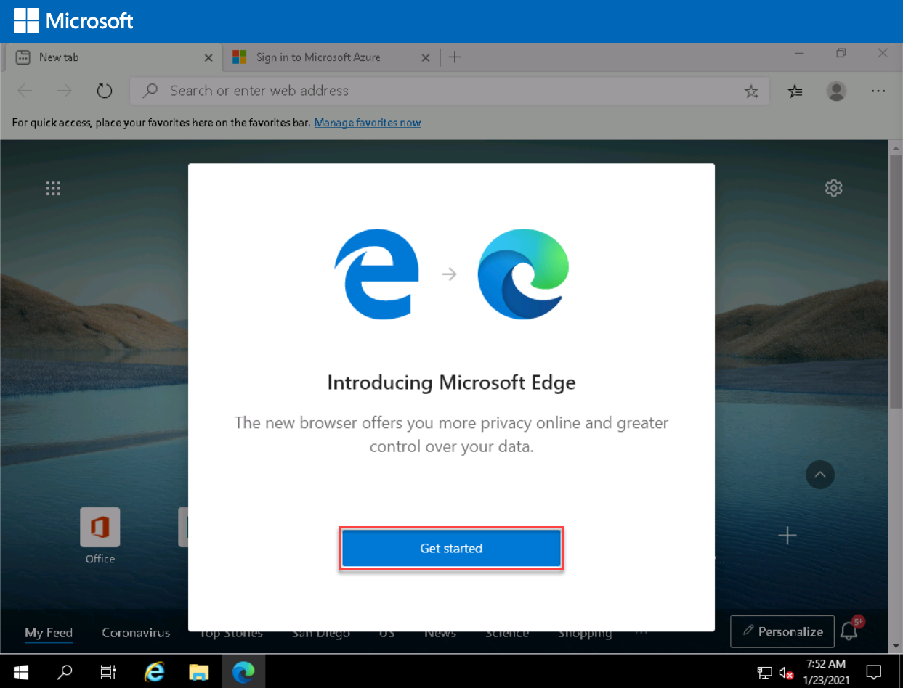
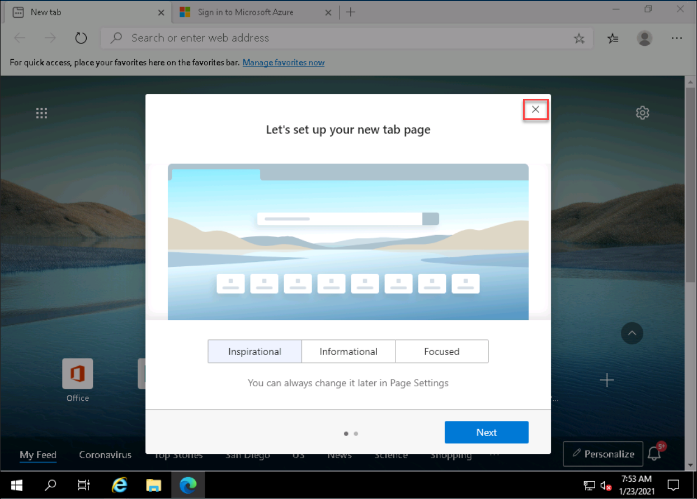
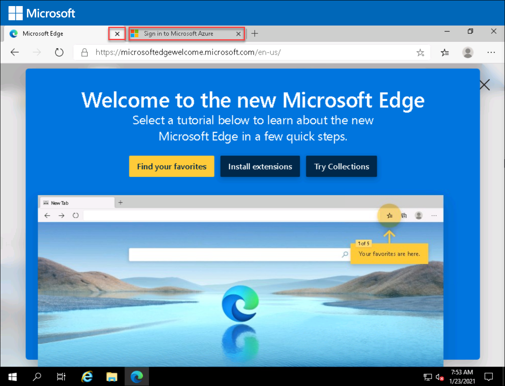
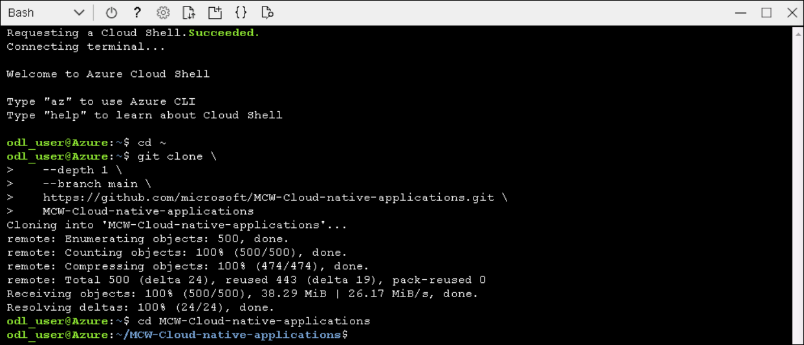

## Before the hands-on lab

**Duration**: 60 minutes

## Overview

Before the hands-on lab, you will need to prepare the environment by deploying the database and the application locally on a virtual machine using Docker and MongoDB. You will also need to fork the GitHub repository containing the lab to your own GitHub account to be able to set up the CI/CD pipeline.


You should follow all the steps provided in this section _before_ taking part in the hands-on lab ahead of time as some of these steps take time.

### Task 1: Set up Azure Cloud Shell

1. In the **JumpVM** provided to you on the left side, double click on the **Azure Portal** browser shortcut on the desktop.
 
   
   
1. Click on **Get Started** on Edge browser.

   
   
1. Now, click on the cross icon to close **Let's set up your new tab page**.

   
   
1. Close the current tab by clicking on close tab icon and then **Sign in Microsoft Azure** tab will open.
 
   
 
1. On **Sign in to Microsoft Azure** tab, **Sign in** with following Azure credentials.
 
     * Azure Usename/Email: <inject key="AzureAdUserEmail"></inject> 
 
     * Azure Password: <inject key="AzureAdUserPassword"></inject> 
 
1. If you see the pop-up **Stay Signed in?**, click Yes. 
 
1. If you see the pop-up **You have free Azure Advisor recommendations!**, close the window to continue the lab. 
 
1. If a **Welcome to Microsoft Azure** popup window appears, click **Maybe Later** to skip the tour.

1. In the **Azure portal**, open the **Azure Cloud Shell** by clicking on the cloud shell icon in the top menu bar. Alternatively, you can open cloud shell by navigating to ```https://shell.azure.com```.

   

1. After launching the Azure Cloud Shell, select the **Bash** option. Now on You have no storage mounted dialog box click on **Show advanced settings**. Select Create new under Storage account and provide values as below: 
  
      - **Storage account** : **storage{Deployementid}**
      - **File Share** : **blob**
  
    > **Note**: Storage account name should be always unique, you can get the Deployement Id  from the **Environment Details** tab. 

   


### Task 2: Download Starter Files

In this task, you use `git` to copy the lab content to your cloud shell so that the lab starter files will be available.

1. 1. Copy the following command to clone the lab files using cloudshell and check out the starter files from the MCW Cloud-native applications GitHub repository and detach them from the existing remote repository via the following commands:

   ```bash
   cd ~
   git clone \
      --depth 1 \
      --branch main \
      https://github.com/microsoft/MCW-Cloud-native-applications.git \
      MCW-Cloud-native-applications
   cd MCW-Cloud-native-applications
   ```

   
   
### Task 3: Create GitHub Personal Access Token

1. In a new browser tab open ```https://www.github.com``` and Log in with your personal GitHub account.

    > **Note** : You have to use your own GitHub account. If you don't have a GitHub account then navigate to the following link ```https://github.com/join ``` and create one.

2. Create a Personal Access Token as described below:

   - In the upper-right corner of your GitHub page, click your profile photo, then click **Settings (1)** and in the left sidebar click **Developer settings (2)**.

     

   - Then in the left sidebar, click **Personal access tokens (3)** and select **Generate new token (4)** button on the right. Provide the GitHub password if prompted. 
   
     

3. Select the scopes or permissions you would like to grant this token

    - **Note**: Provide the following text in the note field, **{DeploymentId}-token**. 
    
    - **Select scopes**:

        * repo - Full control of private repositories
        * workflow - Update GitHub Action workflows
        * write:packages - Upload packages to GitHub Package Registry
        * delete:packages - Delete packages from GitHub Package Registry
        * read:org - Read org and team membership, read org projects
  
      

    - Click **Generate token**.

      

4. Click on the Copy icon to copy the token to your clipboard and save it on your notepad. For security reasons, after you navigate off the page, you will not be able to see the token again. **DO NOT COMMIT THIS TO YOUR REPO!**

   
   
   > **Note**: Use Personal Access Token as Password when ever you asked to provide Password while pushing any Git changes in the Lab.

### Task 4: Create a GitHub repository

FabMedical has provided starter files for you. They have taken a copy of the websites for their customer Contoso Neuro and refactored it from a single node.js site into a website with a content API that serves up the speakers and sessions. This refactored code is a starting point to validate the containerization of their websites. Use this to help them complete a POC that validates the development workflow for running the website and API as Docker containers and managing them within the Azure Kubernetes Service environment.

1. Open a web browser and navigate to <https://www.github.com>. Log in using your GitHub account credentials.

2. In the upper-right corner, expand the user drop-down menu and select **Your repositories**.

    

3. Next to the search criteria, locate and select the **New** button.

    

4. On the **Create a new repository** screen, name the repository `Fabmedical` and select the **Create repository** button.

    

5. On the **Quick setup** screen, copy the **HTTPS** GitHub URL for your new repository, paste this into notepad for future use.

    

### Task 5: Set up Azure Cloud Shell environment

1. Set the following environment variables in an Azure Cloud Shell terminal. Make you replace all the values properly.

   > **NOTE**: You can copy the **DeploymentID** from the **Environment Details** page of the environment.

   ```bash
   export MCW_SUFFIX=<PASTE DeploymentID>                   # Needs to be a unique three letter string
   export MCW_GITHUB_USERNAME=<PASTE YOUR GITHUB USERNAME> # Your Github account username
   export MCW_GITHUB_TOKEN=<PASTE YOUR GITHUB PAT TOKEN>        # A personal access token for your Github account
   export MCW_GITHUB_URL=<PASTE YOUR FABMEDICAL REPO URL> 
   export MCW_GITHUB_EMAIL=<YOUR GITHUB EMAIL ID>
   ```

2. Paste the following command to go the right directory and to create a bash file named **bhol.sh**.

   ```bash
   cd ~/MCW-Cloud-native-applications/Hands-on\ lab/lab-files/developer/scripts
   vi bhol.sh
   ```

3. Upon successful execution of the `create_azure_resources.sh` script, a command for establishing an SSH session to the build agent VM should be present in the output.

   ```bash
   Command to create an active session to the build agent VM:

       ssh -i ~/.ssh/fabmedical adminfabmedical@<PUBLIC IP OF VM>
   ```

4. Use the SSH command output in the previous step to establish an SSH session to the build agent VM.  You should be presented with a prompt similar to the following:

   `adminfabmedical@fabmedical-SUFFIX:~$`

   

### Task 6: Complete the build agent setup

1. From an Azure Cloud Shell terminal, use the SSH command output from the previous task and start an active SSH session to the build agent VM.

2. Clone the FabMedical GitHub repository created in the previous task.

   ```bash
   git clone https://github.com/<GITHUB_USERNAME>/Fabmedical
   ```

3. Set the following environment variables in the active SSH session to the build agent VM. Use the same GitHub access token used in a previous task.

   ```bash
   export MCW_SUFFIX=<SUFFIX>                   # Needs to be a unique three letter string
   export MCW_GITHUB_USERNAME=<GITHUB USERNAME> # Your Github account username
   export MCW_GITHUB_TOKEN=<GITHUB PAT>         # A personal access token for your Github account
   ```

4. Run the `create_build_environment.sh` script to set up the build agent VM environment. This script installs necessary dependencies on the build agent VM and applies the configuration settings to the VM's environment necessary for proper execution of the workshop.

   ```bash
   cd ~/Fabmedical/scripts
   bash create_build_environment.sh
   ```

   > **Note**: Ignore any errors you encounter regarding the Docker client. That will be resolved after joining a new SSH session in the following steps.

5. After the script completes execution, type `exit` to exit the SSH session. We will need to join a new SSH session to ensure the docker environment on the build agent VM has completed set up.

   ```bash
   adminfabmedical@fabmedical-???:~/Fabmedical/scripts$ exit
   logout
   Connection to 20.123.9.212 closed.
   matt@Azure:~$ ssh -i ~/.ssh/fabmedical adminfabmedical@20.123.9.212
   matt@Azure:~$ ssh -i .ssh/fabmedical adminfabmedical@20.123.9.212
   Welcome to Ubuntu 16.04.7 LTS (GNU/Linux 4.15.0-1113-azure x86_64)

   * Documentation:  https://help.ubuntu.com
   * Management:     https://landscape.canonical.com
   * Support:        https://ubuntu.com/advantage

   UA Infra: Extended Security Maintenance (ESM) is not enabled.

   0 updates can be applied immediately.

   65 additional security updates can be applied with UA Infra: ESM
   Learn more about enabling UA Infra: ESM service for Ubuntu 16.04 at
   https://ubuntu.com/16-04

   Ubuntu comes with ABSOLUTELY NO WARRANTY, to the extent permitted by
   applicable law.

   New release '18.04.6 LTS' available.
   Run 'do-release-upgrade' to upgrade to it.


   Last login: Sat Dec  4 11:47:31 2021 from 23.100.27.176
   adminfabmedical@fabmedical-mgy:~$
   ```

6. After reestablishing an SSH session to the build agent VM, run the `create_and_seed_database.sh` script to create and seed the MongoDB database for use in the workshop.

   ```bash
   cd ~/Fabmedical/scripts
   bash create_and_seed_database.sh
   ```
7
### Task : Build Docker Images

1. Navigate to the `content-api` directory and build the `content-api` container image using the Dockerfile in the directory. Note how the deployed Azure Container Registry is referenced. Replace the `SUFFIX` placeholder in the command.

   ```bash
   cd ~/Fabmedical/content-api
   docker image build -t fabmedical[SUFFIX].azurecr.io/content-api:latest .
   ```

2. Repeat this step for the `content-web` image, which serves as the application front-end.

   ```bash
   cd ~/Fabmedical/content-web
   docker image build -t fabmedical[SUFFIX].azurecr.io/content-web:latest .
   ```

3. Observe the built Docker images by running `docker image ls`. The images were tagged with `latest`, but it is possible to use other tag values for versioning.

   

4. Log in to Azure Container Registry using `docker login fabmedical[SUFFIX].azurecr.io`. Fetch the credentials from the **Access keys** tab of the ACR instance in the Azure portal.

   

5. Push the two images you built.

   ```bash
   docker image push fabmedical[SUFFIX].azurecr.io/content-api:latest
   docker image push fabmedical[SUFFIX].azurecr.io/content-web:latest
   ```

You should follow all steps provided _before_ performing the Hands-on lab.
