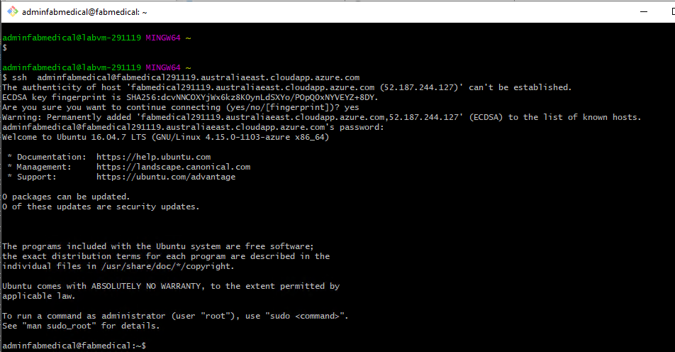
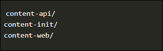

# Before the hands-on lab

**Duration**: 60 minutes

You should follow all of the steps provided in this section _before_ taking part in the hands-on lab ahead of time as some of these steps take time.

## Task 1: Setup the environment and Azure Command Shell on the Lab VM

1. In the **Lab VM** provided to you on the left side, double click on the **Azure Portal** browser shortcut on the desktop.

    

1. Click on **Get Started** on edge browser.

   

1. Now, click on the cross icon to close **Let's set up your new tab page**.

   

1. Close the current tab by clicking on close tab icon and then **Sign in Microsoft Azure** tab will open.

   
 
1. On **Sign in to Microsoft Azure** tab, **Sign in** with following Azure credentials.

     * Azure Usename/Email: <inject key="AzureAdUserEmail"></inject>

     * Azure Password: <inject key="AzureAdUserPassword"></inject>

1. If you see the pop-up **Stay Signed in?**, click Yes.

1. If you see the pop-up **You have free Azure Advisor recommendations!**, close the window to continue the lab.

1. If a **Welcome to Microsoft Azure** popup window appears, click **Maybe Later** to skip the tour.

1. Change the default Browser to Edge using the default apps setting option in Windows.
  
1. Next, update the region + language settings of the Lab VM to region that is appropriate to your setting.
  
  

## Task 2: Connect securely to the build agent

In this section, you validate that you can connect to the new Build Agent VM using the git bash console.

1. From the start menu in the Lab VM, find and Open A new Command shell window (either Cmd.exe or Git Bash)

1. Connect to build agent vm using the **Command to Connect to Build Agent VM** value provided in on lab **environment details** section of the guide. Example below

    >ssh  adminfabmedical@fabmedical327955.westus.cloudapp.azure.com

1. When asked to confirm if you want to continue connecting, type `yes`.

1. When asked for the password, enter **Build Agent VM Password** given below.

    ```pwd
    Password.1!!
    ```

1. SSH connects to the VM and displays a command prompt such as the following. Keep this shell window open throughout this workshop:

   `adminfabmedical@fabmedical:~$`

   

1. We will need to use the Azure CLI commands in various exercises. Hence, Before you can use the Azure CLI, you will need to login:

    ```bash
    az login
    ```

1. You will see a prompt similar to the following in the SSH terminal:

    ```http
    To sign in, use a web browser to open the page https://microsoft.com/devicelogin and enter the code AZC5XB4YS to authenticate.
    ```

1. Open the supplied URL in a browser and then paste in the supplied code. Select Continue to proceed with the login

1. Sign in with the Azure credentials already provided.

1. After logging in, return to SSH prompt within the Shell window. It should update by displaying your list of subscriptions.

    > **Note**: Pressing ENTER may be required to trigger the update of the shell screen.

## Task 3: Download Starter Files and setup source folder

In this task, you will use `git` to copy the lab content to your VM and copy the folders to used as source repos.

1. Copy the following command to clone the lab files and then delete **.git** directory, because **.git** directory is not required. Next, copy the source folders that we need for the Fabmedical web application. Paste the below commands in the SSH session and then press `<ENTER>`:

     ```bash
     git clone https://github.com/microsoft/MCW-Cloud-native-applications.git
     rm -rf MCW-Cloud-native-applications/.git
     mkdir Fabmedical
     cd Fabmedical
     cp ~/MCW-Cloud-native-applications/Hands-on\ lab/lab-files/developer/* . -r
     ll
     ```

   

1. You'll see the listing includes three folders, one for the web site, another for the content API and one to initialize API data:

    ```shell
    content-api/
    content-init/
    content-web/
    ```

 > **Note** : You have to use SSH session so don't close it as it will be needed subsequently in Tasks and Exercises.

## Task 4: Create GitHub Personal Access Token

1. In a new browser tab open ```https://www.github.com``` and Log in with your personal GitHub account.

    > **Note** : You have to use your own GitHub account. If you don't have a GitHub account then navigate to the following link ```https://github.com/join ``` and create one.

2. Create a Personal Access Token as described below:

   - In the upper-right corner of your GitHub page, click your profile photo, then click **Settings (1)** and in the left sidebar click **Developer settings (2)**.

     

   - Then in the left sidebar, click **Personal access tokens (3)** and select **Generate new token (4)** button on the right. Provide the GitHub password if prompted. 
   
     

3. Select the scopes or permissions you would like to grant this token

    - **Note**: Provide the following text in the note field, **{DeploymentId}-token**. 
    
    - **Select scopes**:

        * repo - Full control of private repositories
        * workflow - Update GitHub Action workflows
        * write:packages - Upload packages to GitHub Package Registry
        * delete:packages - Delete packages from GitHub Package Registry
        * read:org - Read org and team membership, read org projects
  
      

    - Click **Generate token**.

      

4. Click on the Copy icon to copy the token to your clipboard and save it on your notepad. For security reasons, after you navigate off the page, you will not be able to see the token again. **DO NOT COMMIT THIS TO YOUR REPO!**

   
   
   > **Note**: Use Personal Access Token as Password when ever you asked to provide Password while pushing any Git changes in the Lab. 

### Task 5: Create a GitHub repository

FabMedical has provided starter files for you. They have taken a copy of the websites for their customer Contoso Neuro and refactored it from a single node.js site into a website with a content API that serves up the speakers and sessions. This refactored code is a starting point to validate the containerization of their websites. Use this to help them complete a POC that validates the development workflow for running the website and API as Docker containers and managing them within the Azure Kubernetes Service environment.

1. Ensure you are logged in to your GitHub account.

1. In the upper-right corner, expand the user drop down menu and select **Your repositories**.

    

1. Next to the search criteria, locate and select the **New** button.

    

1. On the **Create a new repository** screen, name the repository ```Fabmedical``` and select the **Create repository** button.

    

1. On the **Quick setup** screen, copy the **HTTPS** GitHub URL for your new repository, paste this in notepad for future use.

    

1. Now, go back to the Bash window. This should be open from steps performed in Task 2

1. Navigate to the **FabMedical** source code folder and list the contents.

      ```bash
    cd ~/Fabmedical
    ll
    ```

1. You'll see the listing includes three folders, one for the web site, another for the content API and one to initialize API data:

   

1. Set your username and email, which git uses for commits, run below commands:
  
    ```
    git config --global user.email "you@example.com"
    git config --global user.name "Your Name"
    ```

1. Using the Cloud Shell, initialize a new git repository:

    ```
    git init
    git add .
    git commit -m "Initial Commit"
    
    ```

1. Set the remote origin to the GitHub URL by issuing the following command, replace ```<your_github_username>``` with your Github username.

    ```
    git remote add origin https://github.com/<your_github_username>/Fabmedical    
    ```

1. Configure git CLI to cache your credentials, so that you don't have to keep re-typing them.

    ```
    git config --global --unset credential.helper
    git config --global credential.helper store
    
    ```

1. Push to the master branch by issuing the following command:

    ```
    git branch -m master main
    git push -u origin main
    
    ```

    > **Note**: Use your Personal Access Token as Password to Push the Git changes.

1. Refresh your GitHub repository, you should now see the code published.
