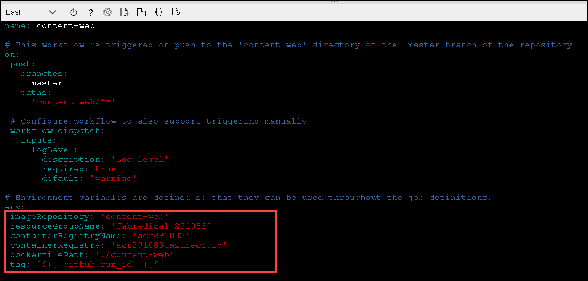

## Exercise 3: Deploy the solution to Azure Kubernetes Service

**Duration**: 30 minutes

In this exercise, you will connect to the Azure Kubernetes Service cluster you created before the hands-on lab and deploy the Docker application to the cluster using Kubernetes.

### Task 1: Tunnel into the Azure Kubernetes Service cluster

In this task, you will gather the information you need about your Azure Kubernetes Service cluster to connect to the cluster and execute commands to connect to the Kubernetes management dashboard from the cloud shell.

> **Note**: The following tasks should be executed in the cloud shell and not in the build machine, so disconnect from the build machine if still connected.

1. Verify that you are connected to the correct subscription with the following command to show your default subscription:

   ```bash
   az account show
   ```

   - If you are not connected to the correct subscription, list your subscriptions and then set the subscription by its id with the following commands (similar to what you did in cloud shell before the lab):

   ```bash
   az account list
   az account set --subscription {id}
   ```

2. Configure kubectl to connect to the Kubernetes cluster:

   ```bash
   az aks get-credentials -a --name fabmedical-SUFFIX --resource-group fabmedical-SUFFIX
   ```
  
   > **Note**: Please make sure to replace `SUFFIX` with DeploymentId.
  
3. Test that the configuration is correct by running a simple kubectl command to produce a list of nodes:

   ```bash
   kubectl get nodes
   ```

   

### Task 2: Deploy a service using the Azure Portal

In this task, you will deploy the API application to the Azure Kubernetes Service cluster using the Azure Portal.

1. From the Azure Portal, select the resource group named fabmedical-DeploymentId, and then select your Kubernetes Service Azure resource.

   

2. We first need to define a Service for our API so that the application is accessible within the cluster. In the AKS blade select **Services and ingresses** and on the Services tab select **+ Add**.

    

3. In the **Add with YAML** screen, paste following YAML and choose **Add**.

   ```yaml
    apiVersion: v1
    kind: Service
    metadata:
      labels:
        app: api
      name: api
    spec:
      ports:
        - name: api-traffic
          port: 3001
          protocol: TCP
          targetPort: 3001
      selector:
        app: api
      sessionAffinity: None
      type: ClusterIP
   ```

4. Now select **Workloads** under the **Kubernetes resources** section in the left navigation.

    

5. From the Workloads view, with **Deployments** selected (the default) then select **+ Add**.

   

6. In the **Add with YAML** screen that loads paste the following YAML and update the `[LOGINSERVER]` placeholder with the name of the ACR instance.

   ```yaml
    apiVersion: apps/v1
    kind: Deployment
    metadata:
      labels:
        app: api
      name: api
    spec:
      replicas: 1
      selector:
        matchLabels:
          app: api
      strategy:
        rollingUpdate:
        maxSurge: 1
        maxUnavailable: 1
        type: RollingUpdate
      template:
        metadata:
          labels:
            app: api
            name: api
        spec:
          containers:
            - name: api
              image: [LOGINSERVER].azurecr.io/content-api
              imagePullPolicy: Always
              livenessProbe:
                httpGet:
                  path: /
                  port: 3001
                initialDelaySeconds: 30
                periodSeconds: 20
                timeoutSeconds: 10
                failureThreshold: 3
              ports:
                - containerPort: 3001
                  hostPort: 3001
                  protocol: TCP
              resources:
                requests:
                  cpu: 1
                  memory: 128Mi
              securityContext:
                privileged: false
                terminationMessagePath: /dev/termination-log
                terminationMessagePolicy: File
                dnsPolicy: ClusterFirst
                restartPolicy: Always
                schedulerName: default-scheduler
                securityContext: {}
                terminationGracePeriodSeconds: 30
   ```

7. Select **Add** to initiate the deployment. This can take a few minutes after which you will see the deployment listed.

   

8. Select the **api** deployment to open the Deployment, select **Live logs** and then a Pod from the drop-down. After a few moments the live logs should appear.

   

   > **Note:** if the logs don't display it may be the Pod no longer exists. You can use **View in Log Analytics** to view historical logs regardless of Pod.

9. If you scroll through the log you can see it indicates that the content-api application is once again failing because it cannot find a MongoDB api to communicate with. You will resolve this issue by connecting to Cosmos DB.

   

10. In the Azure Portal navigate to your resource group and find your Cosmos DB. Select the Cosmos DB resource to view details.

   

11. Under **Quick Start** select the **Node.js** tab and copy the **Node.js 3.0 connection string**.

    

12. Modify the copied connection string by adding the database `contentdb` to the URL, along with a replicaSet of `globaldb`. The resulting connection string should look like the below sample.

    ```text
    mongodb://<USERNAME>:<PASSWORD>@fabmedical-<SUFFIX>.mongo.cosmos.azure.com:10255/contentdb?ssl=true&replicaSet=globaldb
    ```
    
    
    

13. You will setup a Kubernetes secret to store the connection string and configure the `content-api` application to access the secret. First, you must base64 encode the secret value. Open your Azure Cloud Shell window and use the following command to encode the connection string and then, copy the output.

    > **Note**: Double quote marks surrounding the connection string are required to successfully produce the required output.

    ```bash
    echo -n "[CONNECTION STRING VALUE]" | base64 -w 0 - | echo $(</dev/stdin)
    ```

    

14. Return to the AKS blade in the Azure Portal and select **Configuration** under the **Kubernetes resources** section. Select **Secrets** and choose **+ Add**.

15. In the **Add with YAML** screen, paste the following YAML and replace the placeholder with the encoded connection string from your clipboard and choose **Add**. Note that YAML is position sensitive so you must ensure indentation is correct when typing or pasting.

    ```yaml
    apiVersion: v1
    kind: Secret
    metadata:
      name: cosmosdb
    type: Opaque
    data:
      db: <base64 encoded value>
    ```

    

16. Sort the Secrets list by name and you should now see your new secret displayed.

    

17. View the details for the **cosmosdb** secret by selected it in the list.

    

18. Next, download the api deployment configuration using the following command in your Azure Cloud Shell window:

    ```bash
    kubectl get -o=yaml deployment api > api.deployment.yml
    ```

19. Edit the downloaded file using cloud shell code editor:

    ```bash
    code api.deployment.yml
    ```

    Add the following environment configuration to the container spec, below the `image` property:

    ```yaml
      env:
      - name: MONGODB_CONNECTION
        valueFrom:
          secretKeyRef:
            name: cosmosdb
            key: db
    ```

    

20. Save your changes and close the editor.

    

21. Update the api deployment by using `kubectl` to deploy the API.

    ```bash
    kubectl delete deployment api
    kubectl create -f api.deployment.yml
    ```

22. In the Azure Portal return to Live logs (see Step 5). The last log should show as connected to MongoDB.

    

### Task 3: Deploy a service using kubectl

In this task, deploy the web service using `kubectl`.

1. Open a **new** Azure Cloud Shell console.

2. Create a text file called `web.deployment.yml` using the Azure Cloud Shell
   Editor.

   ```bash
   code web.deployment.yml
   ```

3. Copy and paste the following text into the editor:

   > **Note**: Be sure to copy and paste only the contents of the code block carefully to avoid introducing any special characters.

   ```yaml
   apiVersion: apps/v1
   kind: Deployment
   metadata:
     labels:
         app: web
     name: web
   spec:
     replicas: 1
     selector:
         matchLabels:
           app: web
     strategy:
         rollingUpdate:
           maxSurge: 1
           maxUnavailable: 1
         type: RollingUpdate
     template:
         metadata:
           labels:
               app: web
           name: web
         spec:
           containers:
           - image: [LOGINSERVER].azurecr.io/content-web
             env:
               - name: CONTENT_API_URL
                 value: http://api:3001
             livenessProbe:
               httpGet:
                   path: /
                   port: 3000
               initialDelaySeconds: 30
               periodSeconds: 20
               timeoutSeconds: 10
               failureThreshold: 3
             imagePullPolicy: Always
             name: web
             ports:
               - containerPort: 3000
                 hostPort: 80
                 protocol: TCP
             resources:
               requests:
                   cpu: 1000m
                   memory: 128Mi
             securityContext:
               privileged: false
             terminationMessagePath: /dev/termination-log
             terminationMessagePolicy: File
           dnsPolicy: ClusterFirst
           restartPolicy: Always
           schedulerName: default-scheduler
           securityContext: {}
           terminationGracePeriodSeconds: 30
   ```

4. Update the `[LOGINSERVER]` entry to match the name of your ACR Login Server.

5. Select the **...** button and choose **Save**.

   

6. Select the **...** button again and choose **Close Editor**.

   

7. Create a text file called `web.service.yml` using the Azure Cloud Shell
   Editor.

   ```bash
   code web.service.yml
   ```

8. Copy and paste the following text into the editor:

   > **Note**: Be sure to copy and paste only the contents of the code block carefully to avoid introducing any special characters.

   ```yaml
   apiVersion: v1
   kind: Service
   metadata:
     labels:
       app: web
     name: web
   spec:
     ports:
       - name: web-traffic
         port: 80
         protocol: TCP
         targetPort: 3000
     selector:
       app: web
     sessionAffinity: None
     type: LoadBalancer
   ```

9. Save changes and close the editor.

10. Type the following command to deploy the application described by the YAML files. You will receive a message indicating the items kubectl has created a web deployment and a web service.

    ```bash
    kubectl create --save-config=true -f web.deployment.yml -f web.service.yml
    ```

    

11. Return to the AKS blade in the Azure Portal. From the navigation menu, under **Kubernetes resources**, select the **Services and ingresses** view. You should be able to access the website via an external endpoint.

    

12. In the top navigation, select the `speakers` and `sessions` links.

    

### Task 4: Deploy a service using a Helm chart

In this task, you will deploy the web service using a [Helm](https://helm.sh/) chart to streamline the installing and managing the container-based application on the Azure Kubernetes cluster.

You will configure a Helm Chart that will be used to deploy and configure the **content-web** container image to Kubernetes. This is a technique that can be used to more easily deploy and manage the application on the Azure Kubernetes Cluster.

1. From the AKS blade in the Azure Portal, under **Kubernetes resources**, select **Workloads**.

2. Select the `web` Deployment and then choose **Delete**. When prompted, check **Confirm delete** and select **Delete** again.

   

3. From the AKS blade in the Azure Portal, under **Kubernetes resources**, select **Services and ingresses**.

4. Select the `web` Service and then choose **Delete**. When prompted, check **Confirm delete** and select **Delete** again.

   

5. Open a **new** Azure Cloud Shell.

6. Clone your fabmedical repository (replace URL with URL of your repository):

    ```bash
    cd clouddrive
    git clone https://github.com/USER_NAME/Fabmedical.git
    ```

7. We will use the `helm create` command to scaffold out a chart implementation that we can build on. Use the following commands to create a new chart named `web` in a new directory (`replace 'fabmedical' with the directory created by your clone`):

    ```bash
    cd fabmedical
    cd content-web
    mkdir charts
    cd charts
    helm create web
    ```

8. We now need to update the generated scaffold to match our requirements. We will first update the file named `values.yaml`.

    ```bash
    cd web
    code values.yaml
    ```

9. Search for the `image` definition and update the values so that they match the following:

    ```yaml
    image:
      repository: [LOGINSERVER].azurecr.io/content-web
      pullPolicy: Always
    ```
    

10. Search for `nameOverride` and `fullnameOverride` entries and update the values so that they match the following:

    ```yaml
    nameOverride: "web"
    fullnameOverride: "web"
    ```
    


11. Search for the `service` definition and update the values so that they match the following:

    ```yaml
    service:
      type: LoadBalancer
      port: 80
    ```
    


12. Search for the `resources` definition and update the values so that they match the following. You are removing the curly braces and adding the `requests` (make sure to remove the {} characters after the `resource:` node):

    ```yaml
    resources:
      # We usually recommend not to specify default resources and to leave this as a conscious
      # choice for the user. This also increases chances charts run on environments with little
      # resources, such as Minikube. If you do want to specify resources, uncomment the following
      # lines, adjust them as necessary, and remove the curly braces after 'resources:'.
      # limits:
      #  cpu: 100m
      #  memory: 128Mi
      requests:
        cpu: 1000m
        memory: 128Mi
    ```
    

13. Save changes and close the editor.

14. We will now update the file named `Chart.yaml`.

    ```bash
    code Chart.yaml
    ```

15. Search for the `appVersion` entry and update the value so that it matches the following:

    ```yaml
    appVersion: latest
    ```
    

16. We will now update the file named `deployment.yaml`.

    ```bash
    cd templates
    code deployment.yaml
    ```

17. Search for the `metadata` definition and update the values so that they match the following. You are replacing the line under annotations:

    ```yaml
    apiVersion: apps/v1
    kind: Deployment
    metadata:
      (...)
    spec:
      (...)
      template:
        metadata:
          (...)
          annotations:
            rollme: {{ randAlphaNum 5 | quote }}
    ```
    

18. Search for the `containers` definition and update the values so that they match the following. You are changing the `containerPort`, `livenessProbe` port and adding the `env` variable:

    ```yaml
    containers:
      - name: {{ .Chart.Name }}
        securityContext:
          {{- toYaml .Values.securityContext | nindent 12 }}
        image: "{{ .Values.image.repository }}:{{ .Chart.AppVersion }}"
        imagePullPolicy: {{ .Values.image.pullPolicy }}
        ports:
          - name: http
            containerPort: 3000
            protocol: TCP
        env:
          - name: CONTENT_API_URL
            value: http://api:3001
        livenessProbe:
          httpGet:
            path: /
            port: 3000
    ```
    
    

19. Save changes and close the editor.

20. We will now update the file named `service.yaml`.

    ```bash
    code service.yaml
    ```

21. Search for the `ports` definition and update the values so that they match the following:

    ```yaml
    ports:
      - port: {{ .Values.service.port }}
        targetPort: 3000
        protocol: TCP
        name: http
    ```
    

22. Save changes and close the editor.

23. The chart is now setup to deploy our web container. Run the following command to deploy the application described by the Helm chart. You will receive a message indicating that helm has created a web deployment and a web service.

    ```bash
    cd ../..
    helm install web ./web
    ```

    

24. Return to the browser where you have the Azure Portal open and navigate. From the Azure Kubernetes service navigation menu, select **Services and ingresses**. You will see the web service deploying which deployment can take a few minutes. When it completes, you should be able to access the website via an external endpoint.

    

25. Select the speakers and sessions links and check that content is displayed for each.

    

26. We will now commit our Helm chart to our GitHub repository. Execute the following commands in the root folder of your 'fabmedical' clone:

    ```bash
    git add content-web/charts/
    git commit -m "Helm chart added."
    git push
    ```

### Task 5: Configure Continuous Delivery to the Kubernetes Cluster

In this task, you will use GitHub Actions workflows to automate the process for deploying the web image to the AKS cluster. You will update the workflow and configure a job so that when new images are pushed to the ACR, the pipeline deploys the image to the AKS cluster.

1. In your Azure Cloud Shell session, navigate to the ```~/Fabmedical``` directory:

   ```bash
   cd ~/clouddrive/Fabmedical

   ```
2. Before the GitHub Actions workflows can be setup, the `.github/workflows directory ` needs to be created again and download workflow yml files. Do this by running the following commands:


   ```
   rm -rf ~/clouddrive/Fabmedical/.github/workflows/
   mkdir ~/clouddrive/Fabmedical/.github/workflows/
   cd ~/clouddrive/Fabmedical/.github/workflows/
   wget http://bit.ly/hol-content-web-1 -O content-web.yml
   
   ```
3. Next edit the workflow YAML file.

    ```dotnetcli
    vi content-web.yml

    ```
    
   - Replace `[DeploymentID]` with your DeploymentID value given on Environment details page.

       ```
       # Environment variables are defined so that they can be used throughout the job definitions.
       env:
        imageRepository: 'content-web'
        resourceGroupName: 'fabmedical-[DeploymentID]'
        containerRegistryName: 'acr[DeploymentID]'
        containerRegistry: 'acr[DeploymentID].azurecr.io'
        dockerfilePath: './content-web'
        tag: '${{ github.run_id  }}'

       ```
       
    
    
4. Verify that the second job is present at the bottom of the `content-web.yml` workflow. 

    ```yaml
      build-and-push-helm-chart:
        name: Build and Push Helm Chart
        runs-on: ubuntu-latest
        needs: [build-and-publish-docker-image]
        steps:
        # Checkout the repo
        - uses: actions/checkout@master

        - name: Helm Install
          uses: azure/setup-helm@v1

        - name: Helm Repo Add
          run: |
            helm repo add ${{ env.containerRegistryName }} https://${{ env.containerRegistry }}/helm/v1/repo --username ${{ secrets.ACR_USERNAME }} --password ${{ secrets.ACR_PASSWORD }}
          env:
            HELM_EXPERIMENTAL_OCI: 1

        - name: Helm Chart Save
          run: |
            cd ./content-web/charts/web

            helm chart save . content-web:v${{ env.tag }}
            helm chart save . ${{ env.containerRegistry }}/helm/content-web:v${{ env.tag }}

            # list out saved charts
            helm chart list
          env:
            HELM_EXPERIMENTAL_OCI: 1

        - name: Helm Chart Push
          run: |
            helm registry login ${{ env.containerRegistry }} --username ${{ secrets.ACR_USERNAME }} --password ${{ secrets.ACR_PASSWORD }}
            helm chart push ${{ env.containerRegistry }}/helm/content-web:v${{ env.tag }}
          env:
            HELM_EXPERIMENTAL_OCI: 1
    ```

5. Save the file and exit VI by pressing `<Esc>` then `:wq`.

6. In the Azure Cloud Shell, use the following command to output the `/.kube/config` file that contains the credentials for authenticating with Azure Kubernetes Service. These credentials were retrieved previously and will also be needed by GitHub Actions to deploy to AKS. Then copy the contents of the file.

    ```bash
    cat ~/.kube/config
    ```

7. In GitHub, return to the **Fabmedical** repository screen, select the **Settings** tab, from the left menu select **Secrets** and then select the **New secret** button.

8. Create a new GitHub Secret with the Name of `KUBECONFIG` and paste in the contents of the `~/.kube/config` file that was previously copied.

    

9. Now naviagte back to the `Fabmedical` directory:
   
   ```bash
   cd ~/clouddrive/Fabmedical

   ```
   
10. Download the workflow yml files, do this by running the following commands:

      ```
      cd ~/clouddrive/Fabmedical/.github/workflows/
      wget http://bit.ly/hol-content-web-2 -O content-web.yml
      ```
11. Next edit the workflow YAML file.

    ```dotnetcli
    vi content-web.yml

    ```

   - Replace `[DeploymentID]` with your DeploymentID value given on Environment details page.

       ```
       # Environment variables are defined so that they can be used throughout the job definitions.
       env:
        imageRepository: 'content-web'
        resourceGroupName: 'fabmedical-[DeploymentID]'
        containerRegistryName: 'acr[DeploymentID]'
        containerRegistry: 'acr[DeploymentID].azurecr.io'
        dockerfilePath: './content-web'
        tag: '${{ github.run_id  }}'

       ```

     
 
  
12. Verify that the second job is present at the bottom of the `content-web.yml` workflow. 

    ```yaml
      aks-deployment:
        name: AKS Deployment
        runs-on: ubuntu-latest
        needs: [build-and-publish-docker-image,build-and-push-helm-chart]
        steps:
        # Checkout the repo
        - uses: actions/checkout@master

        - name: Helm Install
          uses: azure/setup-helm@v1

        - name: kubeconfig
          run: echo "${{ secrets.KUBECONFIG }}" >> kubeconfig

        - name: Helm Repo Add
          run: |
            helm repo add ${{ env.containerRegistry }} https://${{ env.containerRegistry }}/helm/v1/repo --username ${{ secrets.ACR_USERNAME }} --password ${{ secrets.ACR_PASSWORD }}
            helm repo update
          env:
            HELM_EXPERIMENTAL_OCI: 1

        - name: Helm Upgrade
          run: |
            helm registry login ${{ env.containerRegistry }} --username ${{ secrets.ACR_USERNAME }} --password ${{ secrets.ACR_PASSWORD }}
            helm chart pull ${{ env.containerRegistry }}/helm/content-web:v${{ env.tag }}
            helm chart export ${{ env.containerRegistry }}/helm/content-web:v${{ env.tag }} --destination ./upgrade
            helm upgrade web ./upgrade/web
          env:
            KUBECONFIG: './kubeconfig'
            HELM_EXPERIMENTAL_OCI: 1
    ```

13. Save the file and exit VI by pressing `<Esc>` then `:wq`.

14. Commit your changes

   ```bash
   cd ..
   git pull
   git add --all
   git commit -m "Deployment update."
   git push
   ```

15. Switch back to GitHub.

16. On the **content-web** workflow, select **Run workflow** and manually trigger the workflow to execute.

    

17. Selecting the currently running workflow will display its status.

    

### Task 6: Review Azure Monitor for Containers

In this task, you will access and review the various logs and dashboards made available by Azure Monitor for Containers.

1. From the Azure Portal, select the resource group named `fabmedical-SUFFIX`, and then select your `Kubernetes Service` Azure resource.

   

2. From the Monitoring blade, select **Insights**.

   

3. Review the various available dashboards and a deeper look at the various metrics and logs available on the Cluster, Nodes, Controllers, and deployed Containers.

   

4. To review the Containers dashboards and see more detailed information about each container, select the **Containers** tab.

   

5. Now filter by container name and search for the **web** containers, you will see all the containers created in the Kubernetes cluster with the pod names.

   

6. By default, the CPU Usage metric will be selected displaying all cpu information for the selected container, to switch to another metric open the metric dropdown list and select a different metric.

   

7. Upon selecting any pod, all the information related to the selected metric will be displayed on the right panel, and that would be the case when selecting any other metric, the details will be displayed on the right panel for the selected pod.

   

8. To display the logs for any container simply select it and view the right panel and you will find "**View container logs**" option which will list all logs for this specific container.

   

   

9. For each log entry, you can display more information by expanding the log entry to view the below details.

   
