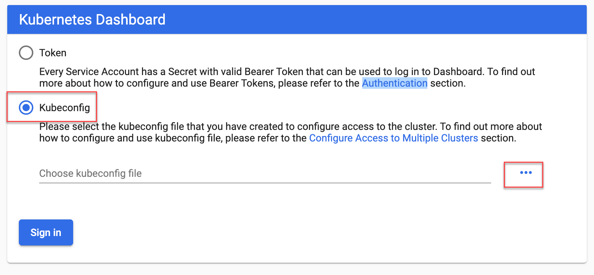

## Exercise 3: Deploy the solution to Azure Kubernetes Service

**Duration**: 30 minutes

In this exercise, you will connect to the Azure Kubernetes Service cluster you created before the hands-on lab and deploy the Docker application to the cluster using Kubernetes.

### Task 1: Tunnel into the Azure Kubernetes Service cluster

In this task, you will gather the information you need about your Azure Kubernetes Service cluster to connect to the cluster and execute commands to connect to the Kubernetes management dashboard from cloud shell.

> **Note**: The following tasks should be executed in cloud shell and not the build machine, so disconnect from build machine if still connected.

1. Verify that you are connected to the correct subscription with the following command to show your default subscription:

   ```bash
   az account show
   ```

   - If you are not connected to the correct subscription, list your subscriptions and then set the subscription by its id with the following commands (similar to what you did in cloud shell before the lab):

   ```bash
   az account list
   az account set --subscription {id}
   ```

2. Configure kubectl to connect to the Kubernetes cluster:

   ```bash
   az aks get-credentials -a --name fabmedical-SUFFIX --resource-group fabmedical-SUFFIX
   ```

3. Test that the configuration is correct by running a simple kubectl command to produce a list of nodes:

   ```bash
   kubectl get nodes
   ```

   

4. Since the AKS cluster uses RBAC, a `ClusterRoleBinding` must be created before you can correctly access the dashboard. To create the required binding, execute the command below:

   ```bash
   kubectl create clusterrolebinding kubernetes-dashboard --clusterrole=cluster-admin --serviceaccount=kube-system:kubernetes-dashboard
   ```

   > **Note**: If you get an error saying `error: failed to create clusterrolebinding: clusterrolebindings.rbac.authorization.k8s.io "kubernetes-dashboard" already exists` just ignore it and move on to the next step.

5. Before you can create an SSH tunnel and connect to the Kubernetes Dashboard, you will need to download the **Kubeconfig** file within Azure Cloud Shell that contains the credentials you will need to authenticate to the Kubernetes Dashboard.

    Within the Azure Cloud Shell, use the following command to download the Kubeconfig file:

    ```bash
    download /home/<username>/.kube/config
    ```

    Make sure to replace the `<username>` placeholder with your name from the command-line in the Azure Cloud Shell.

    >**Note**: You can find the `<username>` from the first part of the Azure Cloud Shell command-line prompt; such as `<username>@Azure:~$`.
    >
    > You can also look in the `/home` directory and so see the directory name that exists within it to find the correct username directory where the Kubeconfig file resides:
    >
    > ```bash
    > ls /home
    > ```

6. Create an SSH tunnel linking a local port (`8001`) on your cloud shell host to port 443 on the management node of the cluster. Cloud shell will then use the web preview feature to give you remote access to the Kubernetes dashboard. Execute the command below replacing the values as follows:

   > **Note**: After you run this command, it may work at first and later lose its connection, so you may have to run this again to reestablish the connection. If the Kubernetes dashboard becomes unresponsive in the browser this is an indication to return here and check your tunnel or rerun the command.

   ```bash
   az aks browse --name fabmedical-SUFFIX --resource-group fabmedical-SUFFIX
   ```

   

7. If the tunnel is successful, you will see the Kubernetes Dashboard authentication screen. Select the **Kubeconfig** option, select the ellipsis (`...`) button, select the **Kubeconfig** file that was previously downloaded, then select **Sign in**.

    

8. Once authenticated, you will see the Kubernetes management dashboard.

   

   > **Note**: If the tunnel is not successful (if a JSON output is displayed), execute the command below and then return to task 5 above:
   >
   > ```bash
   > az extension add --name aks-preview
   > ```

### Task 2: Deploy a service using the Kubernetes management dashboard

In this task, you will deploy the API application to the Azure Kubernetes Service cluster using the Kubernetes dashboard.

1. From the Kubernetes dashboard, select **Create** in the top right corner.

2. From the Resource creation view, select **Create from form**.

   - Enter `api` for the App name.

   - Enter `[LOGINSERVER]/content-api` for the Container Image, replacing `[LOGINSERVER]` with your ACR login server, such as `fabmedicalsol.azurecr.io`.

   - Set Number of pods to `1`.

   - Set Service to `Internal`.

   - Use `3001` for Port and `3001` for Target port.
    


3. Select **SHOW ADVANCED OPTIONS**

   - Enter `1` for the CPU requirement (cores).

   - Enter `128` for the Memory requirement (MiB).

   

4. Select **Deploy** to initiate the service deployment based on the image. This can take a few minutes. In the meantime, you will be redirected to the Overview dashboard. Select the **API** deployment from the **Overview** dashboard to see the deployment in progress.

   

5. Kubernetes indicates a problem with the `api` **Replica Set** after some seconds. Select the ellipsis icon, then select **Logs** to investigate.

   

6. The log indicates that the content-api application is once again failing because it cannot find a mongodb api to communicate with. You will resolve this issue by connecting to Cosmos DB.

   

7. Open the Azure portal in your browser and navigate to your resource group and find your Cosmos DB resource. Select the Cosmos DB resource to view details.

   

8. Under **Quick Start** select the **Node.js** tab and copy the **Node.js 3.0 connection string**.

   

9. Update the provided connection string with a database `contentdb` and a replica set `globaldb`.

   > **Note**: Username and password redacted for brevity.

   ```text
   mongodb://<USERNAME>:<PASSWORD>@fabmedical-<SUFFIX>.documents.azure.com:10255/contentdb?ssl=true&replicaSet=globaldb
   ```

10. To avoid disconnecting from the Kubernetes dashboard, open a **new** Azure Cloud Shell console.

    

11. You will setup a Kubernetes secret to store the connection string and configure the `content-api` application to access the secret. First, you must base64 encode the secret value. Open your Azure Cloud Shell window and use the following command to encode the connection string and then, copy the output.

    > **Note**: Double quote marks surrounding the connection string are required to successfully produce the required output.

    ```bash
    echo -n "[CONNECTION STRING VALUE]" | base64 -w 0 - | echo $(</dev/stdin)
    ```

    

12. Return to the Kubernetes UI in your browser and select **+ Create**.

13. In the **Create from input** tab, update the following YAML with the encoded connection string from your clipboard, paste the YAML data into the create dialog, and choose **Upload**.

    ```yaml
    apiVersion: v1
    kind: Secret
    metadata:
      name: cosmosdb
    type: Opaque
    data:
      db: <base64 encoded value>
    ```

    

14. Scroll down in the Kubernetes dashboard until you can see **Secrets** in the left-hand menu. Select it.

    

15. View the details for the **cosmosdb** secret. Select the eyeball icon to show the secret.

    

16. Next, download the api deployment configuration using the following command in your Azure Cloud Shell window:

    ```bash
    kubectl get -o=yaml deployment api > api.deployment.yml
    ```

17. Edit the downloaded file using cloud shell code editor:

    ```bash
    code api.deployment.yml
    ```

    Add the following environment configuration to the container spec, below the `image` property:

    ```yaml
      env:
      - name: MONGODB_CONNECTION
        valueFrom:
          secretKeyRef:
            name: cosmosdb
            key: db
    ```

    

18. Save your changes and close the editor.

    

19. Update the api deployment by using `kubectl` to apply the new configuration.

    ```bash
    kubectl apply -f api.deployment.yml
    ```

    >**Note**: If you receive an error like `Operation cannot be fulfilled on deployment.apps "api"` then delete the deployment and recreate it using the modified `api.deployment.yml` file.

      ```bash
      kubectl delete deployment api
      kubectl create -f api.deployment.yml
      ```

20. Select **Deployments** then **api** to view the api deployment. It now has a healthy instance and the logs indicate it has connected to mongodb.

    

### Task 3: Deploy a service using kubectl

In this task, deploy the web service using `kubectl`.

1. Open a **new** Azure Cloud Shell console.

2. Create a text file called `web.deployment.yml` using the Azure Cloud Shell
   Editor.

   ```bash
   code web.deployment.yml
   ```

3. Copy and paste the following text into the editor:

   > **Note**: Be sure to copy and paste only the contents of the code block carefully to avoid introducing any special characters.

   ```yaml
   apiVersion: apps/v1
   kind: Deployment
   metadata:
     labels:
         app: web
     name: web
   spec:
     replicas: 1
     selector:
         matchLabels:
           app: web
     strategy:
         rollingUpdate:
           maxSurge: 1
           maxUnavailable: 1
         type: RollingUpdate
     template:
         metadata:
           labels:
               app: web
           name: web
         spec:
           containers:
           - image: [LOGINSERVER].azurecr.io/content-web
             env:
               - name: CONTENT_API_URL
                 value: http://api:3001
             livenessProbe:
               httpGet:
                   path: /
                   port: 3000
               initialDelaySeconds: 30
               periodSeconds: 20
               timeoutSeconds: 10
               failureThreshold: 3
             imagePullPolicy: Always
             name: web
             ports:
               - containerPort: 3000
                 hostPort: 80
                 protocol: TCP
             resources:
               requests:
                   cpu: 1000m
                   memory: 128Mi
             securityContext:
               privileged: false
             terminationMessagePath: /dev/termination-log
             terminationMessagePolicy: File
           dnsPolicy: ClusterFirst
           restartPolicy: Always
           schedulerName: default-scheduler
           securityContext: {}
           terminationGracePeriodSeconds: 30
   ```

4. Update the `[LOGINSERVER]` entry to match the name of your ACR Login Server.

5. Select the **...** button and choose **Save**.

   

6. Select the **...** button again and choose **Close Editor**.

   

7. Create a text file called `web.service.yml` using the Azure Cloud Shell
   Editor.

   ```bash
   code web.service.yml
   ```

8. Copy and paste the following text into the editor:

   > **Note**: Be sure to copy and paste only the contents of the code block carefully to avoid introducing any special characters.

   ```yaml
   apiVersion: v1
   kind: Service
   metadata:
     labels:
       app: web
     name: web
   spec:
     ports:
       - name: web-traffic
         port: 80
         protocol: TCP
         targetPort: 3000
     selector:
       app: web
     sessionAffinity: None
     type: LoadBalancer
   ```

9. Save changes and close the editor.

10. Type the following command to deploy the application described by the YAML files. You will receive a message indicating the items kubectl has created a web deployment and a web service.

    ```bash
    kubectl create --save-config=true -f web.deployment.yml -f web.service.yml
    ```

    

11. Return to the browser where you have the Kubernetes management dashboard open. From the navigation menu, under **Discovery and Load Balancing**, select the **Services** view.

12. From the Services view, select the `web` service, and from this view, you will see the web service deploying. This deployment can take a few minutes.

13. When it completes, navigate to the main services link, you should be able to access the website via an external endpoint.

    

14. In the top navigation, select the `speakers` and `sessions` links. Note that no data is displayed, although we have connected to our Cosmos DB instance, there is no data loaded. You will resolve this by running the content-init application as a Kubernetes Job in Task 5.

    

### Task 4: Deploy a service using a Helm chart

In this task, you will deploy the web service using a [Helm](https://helm.sh/) chart to streamline the installing and managing the container-based application on the Azure Kubernetes cluster.

You will configure a Helm Chart that will be used to deploy and configure the **content-web** container image to Kubernetes. This is a technique that can be used to more easily deploy and manage the application on the Azure Kubernetes Cluster.

1. From the Kubernetes dashboard, under **Workloads**, select **Deployments**.

2. Select the triple vertical dots on the right of the `web` deployment and then choose **Delete**. When prompted, select **Delete** again.

   

3. From the Kubernetes dashboard, under **Discovery and Load Balancing**, select **Services**.

4. Select the triple vertical dots on the right of the **web** service and then choose **Delete**. When prompted, select **Delete** again.

   

5. Open a **new** Azure Cloud Shell console.

6. Update your starter files by pulling the latest changes from the Git repository:

    ```bash
    cd ~/MCW-Cloud-native-applications/Hands-on\ lab/lab-files/developer/content-web
    git pull
    ```

7. We will use the `helm create` command to scaffold out a chart implementation that we can build on. Use the following commands to create a new chart named `web` in a new directory:

    ```bash
    mkdir charts
    cd charts
    helm create web
    ```

8. We now need to update the generated scaffold to match our requirements. We will first update the file named `values.yaml`.

    ```bash
    cd web
    code values.yaml
    ```

9. Search for the `image` definition and update the values so that they match the following:

    ```yaml
    image:
      repository: [LOGINSERVER].azurecr.io/content-web
      pullPolicy: Always
    ```

10. Search for `nameOverride` and `fullnameOverride` entries and update the values so that they match the following:

    ```yaml
    nameOverride: "web"
    fullnameOverride: "web"
    ```

11. Search for the `service` definition and update the values so that they match the following:

    ```yaml
    service:
      type: LoadBalancer
      port: 80
    ```

12. Search for the `resources` definition and update the values so that they match the following. You are removing the curly braces and adding the `requests`:

    ```yaml
    resources:
      # We usually recommend not to specify default resources and to leave this as a conscious
      # choice for the user. This also increases chances charts run on environments with little
      # resources, such as Minikube. If you do want to specify resources, uncomment the following
      # lines, adjust them as necessary, and remove the curly braces after 'resources:'.
      # limits:
      #  cpu: 100m
      #  memory: 128Mi
      requests:
        cpu: 1000m
        memory: 128Mi
    ```

13. Save changes and close the editor.

14. We will now update the file named `Chart.yaml`.

    ```bash
    code Chart.yaml
    ```

15. Search for the `appVersion` entry and update the value so that it matches the following:

    ```yaml
    appVersion: latest
    ```

16. Save changes and close the editor.

17. We will now update the file named `deployment.yaml`.

    ```bash
    cd templates
    code deployment.yaml
    ```

18. Search for the `metadata` definition and update the values so that they match the following. You are replacing the line under annotations:

    ```yaml
    apiVersion: apps/v1
    kind: Deployment
    metadata:
      (...)
    spec:
      (...)
      template:
        metadata:
          (...)
          annotations:
            rollme: {{ randAlphaNum 5 | quote }}
    ```

19. Search for the `containers` definition and update the values so that they match the following. You are changing the `containerPort`, `livenessProbe` port and adding the `env` variable:

    ```yaml
    containers:
      - name: {{ .Chart.Name }}
        securityContext:
          {{- toYaml .Values.securityContext | nindent 12 }}
        image: "{{ .Values.image.repository }}:{{ .Chart.AppVersion }}"
        imagePullPolicy: {{ .Values.image.pullPolicy }}
        ports:
          - name: http
            containerPort: 3000
            protocol: TCP
        env:
          - name: CONTENT_API_URL
            value: http://api:3001
        livenessProbe:
          httpGet:
            path: /
            port: 3000
    ```

20. Save changes and close the editor.

20. We will now update the file named `service.yaml`.

    ```bash
    code service.yaml
    ```

22. Search for the `ports` definition and update the values so that they match the following:

    ```yaml
    ports:
      - port: {{ .Values.service.port }}
        targetPort: 3000
        protocol: TCP
        name: http
    ```

23. Save changes and close the editor.

24. The chart is now setup to run our web container. Type the following command to deploy the application described by the YAML files. You will receive a message indicating that helm has created a web deployment and a web service.

    ```bash
    cd ../..
    helm install web ./web
    ```

    

25. Return to the browser where you have the Kubernetes management dashboard open. From the navigation menu, select **Services** view under **Discovery and Load Balancing**. From the Services view, select the **web** service, and from this view, you will see the web service deploying. This deployment can take a few minutes. When it completes, you should be able to access the website via an external endpoint.

    

26. Select the speakers and sessions links. Note that no data is displayed, although we have connected to our Cosmos DB instance, there is no data loaded. You will resolve this by running the content-init application as a Kubernetes Job.

    

27. We will now persist the changes into the repository. Execute the following commands:

    ```bash
    cd ..
    git pull
    git add charts/
    git commit -m "Helm chart added."
    git push
    ```

### Task 5: Test the application in a browser

In this task, you will verify that you can browse to the web service you have deployed and view the speaker and content information exposed by the API service.

1. From the Kubernetes management dashboard, in the navigation menu, select the **Services** view under **Discovery and Load Balancing**.

2. In the list of services, locate the external endpoint for the `web` service and select this hyperlink to launch the application.

   

3. You will see the `web` application in your browser and be able to select the Speakers and Sessions links to view those pages without errors. The lack of errors means that the web application is correctly calling the API service to show the details on each of those pages.

   

   

### Task 6: Configure Continuous Delivery to the Kubernetes Cluster

In this task, you will use GitHub Actions workflows to automate the process for deploying the web image to the AKS cluster. You will update the workflow and configure a job so that when new images are pushed to the ACR, the pipeline deploys the image to the AKS cluster.

1. Navigate to the `.github/workflows` folder of the git repository, and open the `content-web.yml` workflow using `vi`:

    ```bash
    cd ~/MCW-Cloud-native-applications/Hands-on\ lab/lab-files/developer/.github/workflows
    vi content-web.yml
    ```

2. You will add a second job to the bottom of the `content-web.yml` workflow. Paste the following at the end of the file:

    > **Note**: Be careful to check your indenting when pasting. The `build-and-push-helm-chart` node should be indented with 2 spaces and line up with the node for the `build-and-publish-docker-image` job.

    ```yaml
      build-and-push-helm-chart:
        name: Build and Push Helm Chart
        runs-on: ubuntu-latest
        needs: [build-and-publish-docker-image]
        steps:
        # Checkout the repo
        - uses: actions/checkout@master

        - name: Helm Install
          uses: azure/setup-helm@v1

        - name: Helm Repo Add
          run: |
            helm repo add ${{ env.containerRegistryName }} https://${{ env.containerRegistry }}/helm/v1/repo --username ${{ secrets.ACR_USERNAME }} --password ${{ secrets.ACR_PASSWORD }}
          env:
            HELM_EXPERIMENTAL_OCI: 1

        - name: Helm Chart Save
          run: |
            cd ./content-web/charts/web

            helm chart save . content-web:v${{ env.tag }}
            helm chart save . ${{ env.containerRegistry }}/helm/content-web:v${{ env.tag }}

            # list out saved charts
            helm chart list
          env:
            HELM_EXPERIMENTAL_OCI: 1

        - name: Helm Chart Push
          run: |
            helm registry login ${{ env.containerRegistry }} --username ${{ secrets.ACR_USERNAME }} --password ${{ secrets.ACR_PASSWORD }}
            helm chart push ${{ env.containerRegistry }}/helm/content-web:v${{ env.tag }}
          env:
            HELM_EXPERIMENTAL_OCI: 1
    ```

3. Save the file.

4. In the Azure Cloud Shell, use the following command to output the `/.kube/config` file that contains the credentials for authenticating with Azure Kubernetes Service. These credentials were retrieved previously and will also be needed by GitHub Actions to deploy to AKS. Then copy the contents of the file.

    ```bash
    cat ~/.kube/config
    ```

5. In GitHub, return to the **Fabmedical** repository screen, select the **Settings** tab, select **Secrets** from the left menu, then select the **New secret** button.

6. Create a new GitHub Secret with the Name of `KUBECONFIG` and paste in the contents of the `~/.kube/config` file that was previously copied.

    

7. Now return to edit the `content-web.yml` workflow and paste the following at the end of the file.

    > **Note**: Be careful to check your indenting when pasting. The `aks-deployment` node should be indented with 2 spaces and line up with the node for the `build-and-push-helm-chart` job.

    ```yaml
      aks-deployment:
        name: AKS Deployment
        runs-on: ubuntu-latest
        needs: [build-and-publish-docker-image,build-and-push-helm-chart]
        steps:
        # Checkout the repo
        - uses: actions/checkout@master

        - name: Helm Install
          uses: azure/setup-helm@v1

        - name: kubeconfig
          run: echo "${{ secrets.KUBECONFIG }}" >> kubeconfig

        - name: Helm Repo Add
          run: |
            helm repo add ${{ env.containerRegistry }} https://${{ env.containerRegistry }}/helm/v1/repo --username ${{ secrets.ACR_USERNAME }} --password ${{ secrets.ACR_PASSWORD }}
            helm repo update
          env:
            HELM_EXPERIMENTAL_OCI: 1

        - name: Helm Upgrade
          run: |
            helm registry login ${{ env.containerRegistry }} --username ${{ secrets.ACR_USERNAME }} --password ${{ secrets.ACR_PASSWORD }}
            helm chart pull ${{ env.containerRegistry }}/helm/content-web:v${{ env.tag }}
            helm chart export ${{ env.containerRegistry }}/helm/content-web:v${{ env.tag }} --destination ./upgrade
            helm upgrade web ./upgrade/web
          env:
            KUBECONFIG: './kubeconfig'
            HELM_EXPERIMENTAL_OCI: 1
    ```

8. Save the file.

9. Commit your changes

   ```bash
   cd ..
   git pull
   git add --all
   git commit -m "Deployment update."
   git push
   ```

10. Switch back to GitHub.

11. On the **content-web** workflow, select **Run workflow** and manually trigger the workflow to execute.

    

12. Selecting the currently running workflow will display its status.

    

### Task 7: Review Azure Monitor for Containers

In this task, you will access and review the various logs and dashboards made available by Azure Monitor for Containers.

1. From the Azure Portal, select the resource group `fabmedical-{DeploymentId}`, and then select your `Kubernetes Service` Azure resource.

   

2. From the Monitoring blade, select **Insights**.

   

3. Review the various available dashboards and a deeper look at the various metrics and logs available on the Cluster, Nodes, Controllers, and deployed Containers.

   

4. To review the Containers dashboards and see more detailed information about each container, select the **Containers** tab.

   

5. Now filter by container name and search for the **web** containers, you will see all the containers created in the Kubernetes cluster with the pod names. You can compare the names with those in the kubernetes dashboard.

   

6. By default, the CPU Usage metric will be selected displaying all cpu information for the selected container, to switch to another metric open the metric dropdown list and select a different metric.

   

7. Upon selecting any pod, all the information related to the selected metric will be displayed on the right panel, and that would be the case when selecting any other metric, the details will be displayed on the right panel for the selected pod.

   

8. To display the logs for any container simply select it and view the right panel and you will find "View container logs" option which will list all logs for this specific container.

   

   

9. For each log entry you can display more information by expanding the log entry to view the below details.

   

