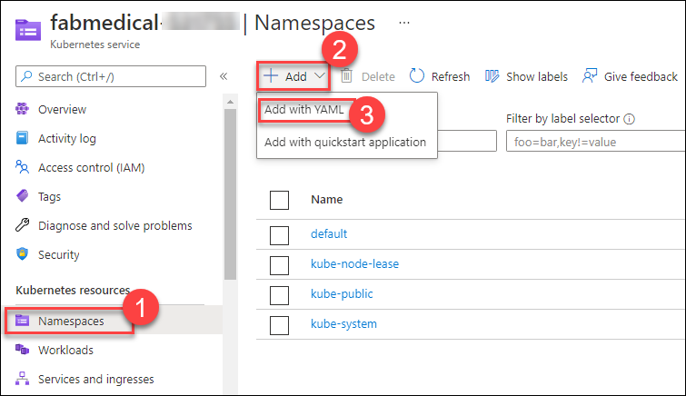

## Exercise 2: Deploy the solution to Azure Kubernetes Service

**Duration**: 60 minutes

In this exercise, you will connect to the Azure Kubernetes Service cluster you created before the hands-on lab and deploy the Docker application to the cluster using Kubernetes.

### Task 1: Tunnel into the Azure Kubernetes Service cluster

In this task, you will gather the information you need about your Azure Kubernetes Service cluster to connect to the cluster and execute commands to connect to the Kubernetes management dashboard from cloud shell.

> **Note**: The following tasks should be executed in cloud shell and not the build machine, so disconnect from build machine if still connected.

1. Verify that you are connected to the correct subscription with the following command to show your default subscription:

   ```bash
   az account show
   ```

   - If you are not connected to the correct subscription, list your subscriptions and then set the subscription by its id with the following commands (similar to what you did in cloud shell before the lab):

   ```bash
   az account list
   az account set --subscription {id}
   ```

2. Configure kubectl to connect to the Kubernetes cluster:

   ```bash
   az aks get-credentials -a --name fabmedical-SUFFIX --resource-group fabmedical-SUFFIX
   ```

3. Test that the configuration is correct by running a simple kubectl command to produce a list of nodes:

   ```bash
   kubectl get nodes
   ```

   

### Task 2: Deploy a service using the Azure Portal

In this task, you will deploy the API application to the Azure Kubernetes Service cluster using the Azure Portal.

1. From the Azure Portal, select the resource group named fabmedical-DeploymentId, and then select your Kubernetes Service Azure resource.

   
   
2. Define a new Namespace for our API deployment. Select the **Namespaces (1)** blade of the fabmedical-[SUFFIX] AKS resource detail page of the Azure Portal. On the Namespaces tab click **+ Add (2)** and select **Add with YAML (3)**.

   

3. In the **Add with YAML** screen, paste the following YAML and choose **Add**.

    ```yaml
    apiVersion: v1
    kind: Namespace
    metadata:
      labels:
        name: ingress-demo
      name: ingress-demo
    ```

4. Define a Service for our API so that the application is accessible within the cluster. Select the **Services and ingresses (1)** blade of the fabmedical-[SUFFIX] AKS resource detail page of the Azure Portal. On the Services tab, click on **+ Add (2)** and select **Add with YAML (3)**.

   

5. In the **Add with YAML** screen, paste following YAML and choose **Add**.

    ```yaml
    apiVersion: v1
    kind: Service
    metadata:
      labels:
        app: api
      name: api
      namespace: ingress-demo
    spec:
      ports:
        - name: api-traffic
          port: 3001
          protocol: TCP
          targetPort: 3001
      selector:
        app: api
      sessionAffinity: None
      type: ClusterIP
    ```

6. Now select **Workloads** under the **Kubernetes resources** section in the left navigation.

    

7. From the Workloads view, with **Deployments** selected (the default) then select **+ Add**.

   

8. In the **Add with YAML** screen that loads paste the following YAML and update the `[LOGINSERVER]` placeholder with the name of the ACR instance.

    ```yaml
    apiVersion: apps/v1
    kind: Deployment
    metadata:
      labels:
          app: api
      name: api
      namespace: ingress-demo
    spec:
      replicas: 1
      selector:
        matchLabels:
          app: api
      strategy:
        rollingUpdate:
          maxSurge: 1
          maxUnavailable: 1
        type: RollingUpdate
      template:
        metadata:
          labels:
              app: api
          name: api
        spec:
          containers:
          - image: [LOGINSERVER].azurecr.io/content-api
            env:
              - name: MONGODB_CONNECTION
                valueFrom:
                  secretKeyRef:
                    name: cosmosdb
                    key: db
            name: api
            imagePullPolicy: Always
            livenessProbe:
              httpGet:
                  path: /
                  port: 3001
              initialDelaySeconds: 30
              periodSeconds: 20
              timeoutSeconds: 10
              failureThreshold: 3
            ports:
              - containerPort: 3001
                hostPort: 3001
                protocol: TCP
            resources:
              requests:
                  cpu: 2000m
                  memory: 128Mi
            securityContext:
              privileged: false
            terminationMessagePath: /dev/termination-log
            terminationMessagePolicy: File
          dnsPolicy: ClusterFirst
          restartPolicy: Always
          schedulerName: default-scheduler
          securityContext: {}
          terminationGracePeriodSeconds: 30
    ```

9. Select **Add** to initiate the deployment. This can take a few minutes after which you will see the deployment listed.

   

10. Select the **api** deployment to open the failing Deployment and observe the failing pod.

    

11. Select the failing pod from the list of pods in the `api` deployment and select **Events**.  Observe that the pod is failing to start because the `cosmosdb` secret is not present.

    

12. In the Azure Portal navigate to your resource group and find your Azure Cosmos DB API for MongoDB account. Select the Cosmos DB resource to view details.

    

13. Under **Quick Start** select the **Node.js** tab and copy the **Node.js 3.0 connection string**.

    

14. Modify the copied connection string by adding the database `contentdb` to the URL, along with a replicaSet of `globaldb`. The resulting connection string should look like the below sample. Note that you may need to modify the endpoint URL.

    ```text
    mongodb://<USERNAME>:<PASSWORD>@fabmedical-<SUFFIX>.mongo.cosmos.azure.com:10255/contentdb?ssl=true&replicaSet=globaldb
    ```
    
    

15. You will setup a Kubernetes secret to store the connection string and configure the `content-api` application to access the secret. First, you must base64 encode the secret value. Open your Azure Cloud Shell window and use the following command to encode the connection string and then, copy the output.

    > **Note**: Double quote marks surrounding the connection string are required to successfully produce the required output.

    ```bash
    echo -n "[CONNECTION STRING VALUE]" | base64 -w 0 - | echo $(</dev/stdin)
    ```

    

16. Return to the AKS blade in the Azure Portal and select **Configuration (1)** under the **Kubernetes resources** section. Select **Secrets (2)** and choose **+ Add (3)**.

    

17. In the **Add with YAML** screen, paste following YAML and replace the placeholder with the encoded connection string from your clipboard and choose **Add**. Note that YAML is position sensitive so you must ensure indentation is correct when typing or pasting.

    ```yaml
    apiVersion: v1
    kind: Secret
    metadata:
      name: cosmosdb
      namespace: ingress-demo
    type: Opaque
    data:
      db: <base64 encoded value>
    ```

    

18. Sort the Secrets list by name and you should now see your new secret displayed.

    

19. View the details for the **cosmosdb** secret by selected it in the list.

    

20. Create a new deployment manifest, `api.deployment.yml` and add the YAML content below to the file. Modify the `LOGINSERVER` placeholder for ACR.

    ```bash
    cd ~/Fabmedical
    code api.deployment.yml
    ```

    ```yaml
    apiVersion: apps/v1
    kind: Deployment
    metadata:
      labels:
          app: api
      name: api
      namespace: ingress-demo
    spec:
      replicas: 1
      selector:
        matchLabels:
          app: api
      strategy:
        rollingUpdate:
          maxSurge: 1
          maxUnavailable: 1
        type: RollingUpdate
      template:
        metadata:
          labels:
              app: api
          name: api
        spec:
          containers:
          - image: [LOGINSERVER].azurecr.io/content-api
            env:
              - name: MONGODB_CONNECTION
                valueFrom:
                  secretKeyRef:
                    name: cosmosdb
                    key: db
            name: api
            imagePullPolicy: Always
            livenessProbe:
              httpGet:
                  path: /
                  port: 3001
              initialDelaySeconds: 30
              periodSeconds: 20
              timeoutSeconds: 10
              failureThreshold: 3
            ports:
              - containerPort: 3001
                hostPort: 3001
                protocol: TCP
            resources:
              requests:
                  cpu: 1000m
                  memory: 128Mi
            securityContext:
              privileged: false
            terminationMessagePath: /dev/termination-log
            terminationMessagePolicy: File
          dnsPolicy: ClusterFirst
          restartPolicy: Always
          schedulerName: default-scheduler
          securityContext: {}
          terminationGracePeriodSeconds: 30    
    ```

21. Save the file and close the editor.

    

22. Update the api deployment by using `kubectl` to deploy the API.

    ```bash
    kubectl delete deployment api -n ingress-demo 
    kubectl create -f api.deployment.yml
    ```

23. In the Azure Portal return to Events blade of the deployed pod in the api deployment (see Step 5). The last log should show as connected to MongoDB.

    

### Task 3: Deploy a service using kubectl

In this task, deploy the web service using `kubectl`.

1. Open a **new** Azure Cloud Shell console.

2. Create a text file called `web.deployment.yml` in the `~/Fabmedical` folder using the Azure Cloud Shell
   Editor.

   ```bash
   cd ~/Fabmedical
   code web.deployment.yml
   ```

3. Copy and paste the following text into the editor:

    > **Note**: Be sure to copy and paste only the contents of the code block carefully to avoid introducing any special characters.

    ```yaml
    apiVersion: apps/v1
    kind: Deployment
    metadata:
      labels:
        app: web
      name: web
      namespace: ingress-demo
    spec:
      replicas: 1
      selector:
        matchLabels:
          app: web
      strategy:
        rollingUpdate:
          maxSurge: 1
          maxUnavailable: 1
        type: RollingUpdate
      template:
        metadata:
          labels:
            app: web
          name: web
        spec:
          containers:
          - image: [LOGINSERVER].azurecr.io/content-web
            env:
              - name: CONTENT_API_URL
                value: http://api:3001
            livenessProbe:
              httpGet:
                path: /
                port: 3000
              initialDelaySeconds: 30
              periodSeconds: 20
              timeoutSeconds: 10
              failureThreshold: 3
            imagePullPolicy: Always
            name: web
            ports:
              - containerPort: 3000
                hostPort: 80
                protocol: TCP
            resources:
              requests:
                cpu: 1000m
                memory: 128Mi
            securityContext:
              privileged: false
            terminationMessagePath: /dev/termination-log
            terminationMessagePolicy: File
          dnsPolicy: ClusterFirst
          restartPolicy: Always
          schedulerName: default-scheduler
          securityContext: {}
          terminationGracePeriodSeconds: 30
    ```

4. Update the `[LOGINSERVER]` entry to match the name of your ACR Login Server.

5. Select the **...** button and choose **Save**.

   

6. Select the **...** button again and choose **Close Editor**.

    

7. Create a text file called `web.service.yml` in the `~/Fabmedical` folder using the Azure Cloud Shell Editor.

    ```bash
    code web.service.yml
    ```

8. Copy and paste the following text into the editor:

    > **Note**: Be sure to copy and paste only the contents of the code block carefully to avoid introducing any special characters.

    ```yaml
    apiVersion: v1
    kind: Service
    metadata:
      labels:
        app: web
      name: web
      namespace: ingress-demo
    spec:
      ports:
        - name: web-traffic
          port: 80
          protocol: TCP
          targetPort: 3000
      selector:
        app: web
      sessionAffinity: None
      type: LoadBalancer
    ```

9. Save changes and close the editor.

10. Execute the commands below to deploy the application described by the YAML files. You will receive a message indicating the items `kubectl` has created a web deployment and a web service.

    ```bash
    cd ~/Fabmedical
    kubectl create --save-config=true -f web.deployment.yml -f web.service.yml
    ```

    

11. Return to the AKS blade in the Azure Portal. From the navigation menu, under **Kubernetes resources**, select the **Services and ingresses** view. You should be able to access the website via an external endpoint.

    

12. In the top navigation, select the `speakers` and `sessions` links.

    

### Task 4: Review Azure Monitor for Containers

In this task, you will access and review the various logs and dashboards made available by Azure Monitor for Containers.

1. From the Azure Portal, select the resource group you created named `fabmedical-SUFFIX`, and then select your `Kubernetes Service` Azure resource.

   

2. From the Monitoring blade, select **Insights**.

   

3. Review the various available dashboards and a deeper look at the various metrics and logs available on the Cluster, Nodes, Controllers, and deployed Containers.

   

4. To review the Containers dashboards and see more detailed information about each container, select the **Containers** tab.

   

5. Now filter by container name and search for the **web** containers, you will see all the containers created in the Kubernetes cluster with the pod names. 

   

6. By default, the CPU Usage metric will be selected displaying all CPU information for the selected container, to switch to another metric open the metric dropdown list and select a different metric.

   

7. Upon selecting any pod, all the information related to the selected metric will be displayed on the right panel, and that would be the case when selecting any other metric, the details will be displayed on the right panel for the selected pod.

   

8. To display the logs for any container simply select it and view the right panel and you will find "View container logs" option which will list all logs for this specific container.

   

   

9. For each log entry you can display more information by expanding the log entry to view the below details.

   
