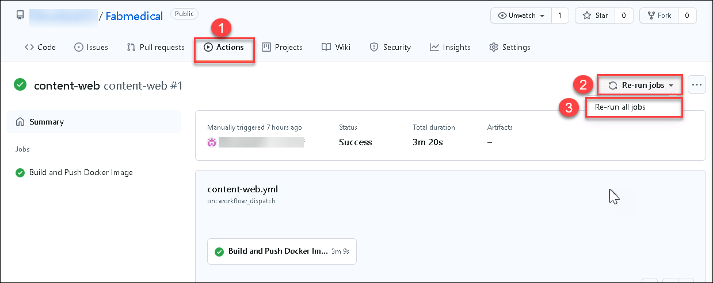
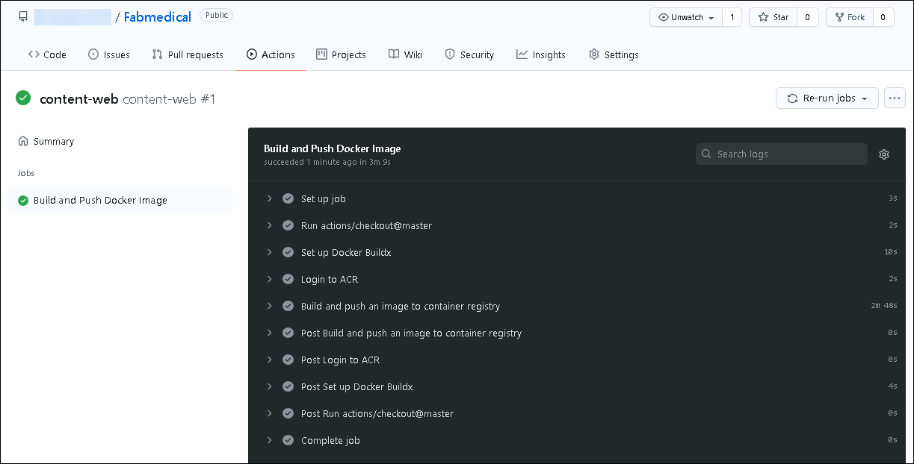
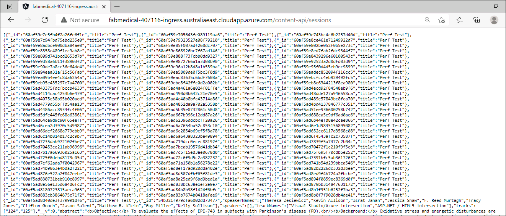

## Exercise 4: Working with services and routing application traffic

**Duration**: 120 minutes

In the previous exercise, we introduced a restriction to the scale properties of the service. In this exercise, you will configure the api deployments to create pods that use dynamic port mappings to eliminate the port resource constraint during scale activities.

Kubernetes services can discover the ports assigned to each pod, allowing you to run multiple instances of the pod on the same agent node --- something that is not possible when you configure a specific static port (such as 3001 for the API service).

### Task 1: Update an external service to support dynamic discovery with a load balancer

In this task, you will update the web service so that it supports dynamic discovery through an Azure load balancer.

1. From AKS **Kubernetes resources** menu, select **Deployments** under **Workloads**. From the list select the **web** deployment.

2. Select **YAML**, then select the **JSON** tab.

3. First locate the replicas node and update the required count to `4`.

4. Next, scroll to the web containers spec as shown in the screenshot. Remove the hostPort entry for the web container's port mapping.

   

5. Select **Review + save** and then confirm the change and **Save**.

6. Check the status of the scale out by refreshing the web deployment's view. From the navigation menu, select **Pods** from under Workloads. Select the **web** pods. From this view, you should see an error like that shown in the following screenshot.

   

Like the API deployment, the web deployment used a fixed _hostPort_, and your ability to scale was limited by the number of available agent nodes. However, after resolving this issue for the web service by removing the _hostPort_ setting, the web deployment is still unable to scale past two pods due to CPU constraints. The deployment is requesting more CPU than the web application needs, so you will fix this constraint in the next task.

### Task 2: Adjust CPU constraints to improve scale

In this task, you will modify the CPU requirements for the web service so that it can scale out to more instances.

1. Re-open the JSON view for the web deployment and then find the **cpu** resource requirements for the web container. Change this value to `125m`.

   

2. Select **Review + save**, confirm the change and then select **Save** to update the deployment.

3. From the navigation menu, select **Replica Sets** under **Workloads**. From the view's Replica Sets list select the web replica set.

4. When the deployment update completes, four web pods should be shown in running state.

   

### Task 3: Perform a rolling update

In this task, you will edit the web application source code to add Application Insights and update the Docker image used by the deployment. Then you will perform a rolling update to demonstrate how to deploy a code change.

1. Execute this command in Azure Cloud Shell to retrieve the instrumentation key for the `content-web` Application Insights resource:

   ```bash
   az resource show -g fabmedical-[SUFFIX] -n content-web --resource-type "Microsoft.Insights/components" --query properties.InstrumentationKey -o tsv
   ```

   Copy this value. You will use it later.

   > **Note**: if you have a blank result check that the command you issued refers to the right resource.

2. Clone your fabmedical repository (replace URL with URL of your repository):

    ```bash
    cd clouddrive
    git clone https://github.com/USER_NAME/Fabmedical.git
    ```

3. On your lab VM update your fabmedical repository files by pulling the latest changes from the git repository:

   ```bash
   cd ~/clouddrive/fabmedical/content-web
   git pull
   ```

4. Install support for Application Insights.

   ```bash
   npm install applicationinsights --save
   ```
   > **Note**: If the above command takes more then 5mins to finish, open a new cloud shell window navigate to content-web directory by  running ``` cd ~/clouddrive/fabmedical/content-web``` and continue with next steps.
 
5. Edit the `app.js` file using Vim or Visual Studio Code remote and add the following lines immediately after `express` is instantiated on line 6:

   ```javascript
   const appInsights = require("applicationinsights");
   appInsights.setup("[YOUR APPINSIGHTS KEY]");
   appInsights.start();
   ```

   

6. Save changes and close the editor.

7. Push these changes to your repository so that GitHub Actions CI will build and deploy a new Container image.

   ```bash
   git add .
   git commit -m "Added Application Insights"
   git push
   ```

8. Visit the `content-web` Action from your GitHub Fabmedical repository and see the new Image being deployed into your Kubernetes cluster. If the GitHub Action is in running state then **skip steps from 9 - 11** and continue from step 12.
  
9. If the GitHub Action for `content-web` haven't started automatically then run the workflow manually by following the next steps.

10. Navigate to GitHub and select **Actions**(1) and then select `content-web` from the list. Click on **Re-run Jobs**(2) and select **Re-run all Jobs**(3)

    
      
11. Wait untill the Build and Push Docker Image of `content-web` **Completes** as shown in the image below:

    

12. Switch to the Azure Portal, From the navigation menu select **Replica Sets** under **Workloads**. From this view, you will see a new replica set for the web, which may still be in the process of deploying (as shown below) or already fully deployed.

    

13. While the deployment is in progress, you can navigate to the web application and visit the stats page at `/stats`. Refresh the page as the rolling update executes. Observe that the service is running normally, and tasks continue to be load balanced.

    

### Task 4: Configure Kubernetes Ingress

In this task you will setup a Kubernetes Ingress using an [nginx proxy server](https://nginx.org/en/) to take advantage of path-based routing and TLS termination.

1. Within the Azure Cloud Shell, run the following command to add the nginx stable Helm repository:

    ```bash
    helm repo add ingress-nginx https://kubernetes.github.io/ingress-nginx
    ```

2. Update your helm package list.

   ```bash
   helm repo update
   ```

   > **Note**: If you get a "no repositories found." error, then run the following command. This will add back the official Helm "stable" repository.
   >
   > ```bash
   > helm repo add stable https://charts.helm.sh/stable 
   > ```

3. Create a namespace in Kubernetes to install the Ingress resources.

    ```bash
    kubectl create namespace ingress-demo
    ```

4. Install the Ingress Controller resource to handle ingress requests as they come in. The Ingress Controller will receive a public IP of its own on the Azure Load Balancer and be able to handle requests for multiple services over port 80 and 443.

   ```bash
   helm install nginx-ingress ingress-nginx/ingress-nginx \
    --namespace ingress-demo \
    --set controller.replicaCount=2 \
    --set controller.nodeSelector."beta\.kubernetes\.io/os"=linux \
    --set defaultBackend.nodeSelector."beta\.kubernetes\.io/os"=linux \
    --set controller.admissionWebhooks.patch.nodeSelector."beta\.kubernetes\.io/os"=linux
   ```

5. In the Azure Portal under **Services and ingresses** copy the IP Address for the **External IP** for the `nginx-ingress-RANDOM-nginx-ingress` service.

   

    > **Note**: It could take a few minutes to refresh, alternately, you can find the IP using the following command in Azure Cloud Shell.
    >
    > ```bash
    > kubectl get svc --namespace ingress-demo
    > ```
    >
   

6. Within the Azure Cloud Shell, create a script to update the public DNS name for the ingress external IP.

   ```bash
   code update-ip.sh
   ```

   Paste the following as the contents. Be sure to replace the following placeholders in the script:

   - `[INGRESS PUBLIC IP]`: Replace this with the IP Address copied from step 5.
   - `[ KUBERNETES_NODE_RG]`: Replace the `SUFFIX` and `REGION` with the region of your resource group.
   - `[SUFFIX]`: Replace this with the same SUFFIX value used previously for this lab.

   ```bash
   #!/bin/bash

   # Public IP address
   IP="[INGRESS PUBLIC IP]"

   # Resource Group that contains AKS Node Pool
   KUBERNETES_NODE_RG="MC_fabmedical-[SUFFIX]_fabmedical-[SUFFIX]_[REGION]"

   # Name to associate with public IP address
   DNSNAME="fabmedical-[SUFFIX]-ingress"

   # Get the resource-id of the public ip
   PUBLICIPID=$(az network public-ip list --resource-group $KUBERNETES_NODE_RG --query "[?ipAddress!=null]|[?contains(ipAddress, '$IP')].[id]" --output tsv)

   # Update public ip address with dns name
   az network public-ip update --ids $PUBLICIPID --dns-name $DNSNAME
   ```

   

7. Save changes and close the editor.

8. Run the update script.

   ```bash
   bash ./update-ip.sh
   ```

9. Verify the IP update by visiting the URL in your browser.

    > **Note**: It is normal to receive a 404 message at this time.

    ```text
    http://fabmedical-[SUFFIX]-ingress.[AZURE-REGION].cloudapp.azure.com/
    ```

    

10. Use helm to install `cert-manager`, a tool that can provision SSL certificates automatically from letsencrypt.org.

    ```bash
    kubectl create namespace cert-manager

    kubectl label namespace cert-manager cert-manager.io/disable-validation=true

    kubectl apply --validate=false -f https://github.com/jetstack/cert-manager/releases/download/v1.0.1/cert-manager.yaml
    ```

11. Cert manager will need a custom ClusterIssuer resource to handle requesting SSL certificates.

    ```bash
    code clusterissuer.yml
    ```

    The following resource configuration should work as is:

    ```yaml
    apiVersion: cert-manager.io/v1
    kind: ClusterIssuer
    metadata:
      name: letsencrypt-prod
    spec:
      acme:
        # The ACME server URL
        server: https://acme-v02.api.letsencrypt.org/directory
        # Email address used for ACME registration
        email: user@fabmedical.com
        # Name of a secret used to store the ACME account private key
        privateKeySecretRef:
          name: letsencrypt-prod
        # Enable HTTP01 validations
        solvers:
        - http01:
            ingress:
              class: nginx
    ```

12. Save changes and close the editor.

13. Create the issuer using `kubectl`.

    ```bash
    kubectl create --save-config=true -f clusterissuer.yml
    ```

14. Now you can create a certificate object.

    > **Note**:
    >
    > Cert-manager might have already created a certificate object for you using ingress-shim.
    >
    > To verify that the certificate was created successfully, use the `kubectl describe certificate tls-secret` command.
    >
    > If a certificate is already available, skip to step 16.

    ```bash
    code certificate.yml
    ```

    Use the following as the contents and update the `[SUFFIX]` and `[AZURE-REGION]` to match your ingress DNS name

    ```yaml
    apiVersion: cert-manager.io/v1
    kind: Certificate
    metadata:
      name: tls-secret
    spec:
      secretName: tls-secret
      dnsNames:
        - fabmedical-[SUFFIX]-ingress.[AZURE-REGION].cloudapp.azure.com
      issuerRef:
        name: letsencrypt-prod
        kind: ClusterIssuer
    ```

15. Save changes and close the editor.

16. Create the certificate using `kubectl`.

    ```bash
    kubectl create --save-config=true -f certificate.yml
    ```

    > **Note**: To check the status of the certificate issuance, use the `kubectl describe certificate tls-secret` command and look for an _Events_ output similar to the following:
    >
    > ```text
    > Type    Reason         Age   From          Message
    > ----    ------         ----  ----          -------
    > Normal  Generated           38s   cert-manager  Generated new private key
    > Normal  GenerateSelfSigned  38s   cert-manager  Generated temporary self signed certificate
    > Normal  OrderCreated        38s   cert-manager  Created Order resource "tls-secret-3254248695"
    > Normal  OrderComplete       12s   cert-manager  Order "tls-secret-3254248695" completed successfully
    > Normal  CertIssued          12s   cert-manager  Certificate issued successfully
    > ```

    It can take between 5 and 30 minutes before the tls-secret becomes available. This is due to the delay involved with provisioning a TLS cert from letsencrypt.

17. Now you can create an ingress resource for the content applications.

    ```bash
    code content.ingress.yml
    ```

    Use the following as the contents and update the `[SUFFIX]` and `[AZURE-REGION]` to match your ingress DNS name:

    ```yaml
    apiVersion: networking.k8s.io/v1beta1
    kind: Ingress
    metadata:
      name: content-ingress
      annotations:
        kubernetes.io/ingress.class: nginx
        nginx.ingress.kubernetes.io/rewrite-target: /$1
        nginx.ingress.kubernetes.io/use-regex: "true"
        nginx.ingress.kubernetes.io/ssl-redirect: "false"
        cert-manager.io/cluster-issuer: letsencrypt-prod
    spec:
      tls:
      - hosts:
          - fabmedical-[SUFFIX]-ingress.[AZURE-REGION].cloudapp.azure.com
        secretName: tls-secret
      rules:
      - host: fabmedical-[SUFFIX]-ingress.[AZURE-REGION].cloudapp.azure.com
        http:
          paths:
          - path: /(.*)
            backend:
              serviceName: web
              servicePort: 80
          - path: /content-api/(.*)
            backend:
              serviceName: api
              servicePort: 3001
    ```

18. Save changes and close the editor.

19. Create the ingress using `kubectl`.

    ```bash
    kubectl create --save-config=true -f content.ingress.yml
    ```

20. Refresh the ingress endpoint in your browser. You should be able to visit the speakers and sessions pages and see all the content.

21. Visit the API directly, by navigating to `/content-api/sessions` at the ingress endpoint.

    ```
    http://fabmedical-[SUFFIX]-ingress.[AZURE-REGION].cloudapp.azure.com/content-api/sessions
    ```

    

22. Test TLS termination by visiting both services again using `https`.

    > **Note**: It can take between 5 and 30 minutes before the SSL site becomes available. This is due to the delay involved with provisioning a TLS cert from letsencrypt.
